# Active Directory Group Policy & Account Security Hardening

**Windows Server 2025 · Active Directory · Group Policy · PowerShell · Hyper-V**

A hands-on security administration project covering password and lockout policy hardening, OU-scoped Group Policy, RSoP modeling, positive/negative scope validation, GPO troubleshooting and remediation, PowerShell auditing, and configuration reporting.

Portfolio documentation | September 2026

---

## Project Overview

- **Environment:** `DC01` in the `arthurlab.test` domain (Hyper-V lab), continuing from a prior AD build-out project.
- **Primary goal:** strengthen domain account controls and demonstrate targeted policy enforcement through Group Policy.
- **Test identities:** Sarah Johnson (Human Resources) and David Wilson (Sales).
- **Validation methods:** PowerShell, Group Policy Management, Group Policy Modeling / RSoP, positive and negative scope tests, and HTML GPO reporting.

All commands referenced below are consolidated in [`scripts/ad-gpo-account-security-audit.ps1`](scripts/ad-gpo-account-security-audit.ps1).

---

## 1. Baseline Assessment

**Step 1 — Confirm Group Policy structure.** Opened Group Policy Management and confirmed the existing domain and OU hierarchy before making changes.

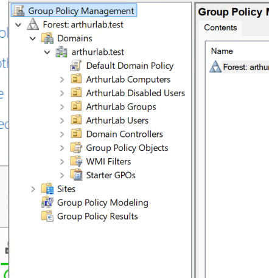

**Step 2 — Audit the default domain password policy.**

```powershell
Get-ADDefaultDomainPasswordPolicy
```

Baseline: complexity enabled, minimum length 7, history 24, lockout threshold 0.

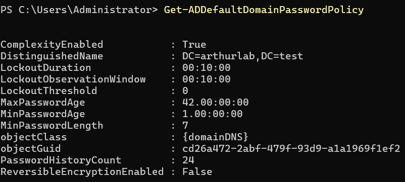

**Step 3 — Confirm the GUI baseline.** Reviewed the Default Domain Policy in Group Policy Management Editor to correlate the PowerShell output with the underlying GPO settings.

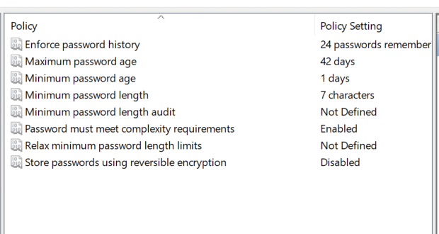

---

## 2. Password and Account Lockout Hardening

**Step 4 — Increase minimum password length.** Changed the domain minimum password length from 7 to 14 characters while retaining complexity and password history requirements.

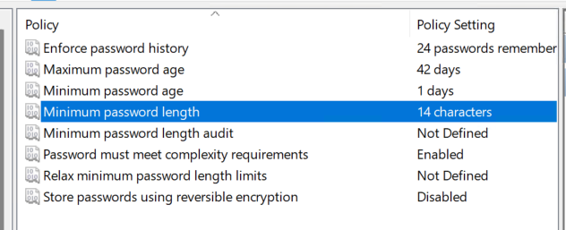

**Step 5 — Verify password hardening** through Active Directory PowerShell.

```powershell
Get-ADDefaultDomainPasswordPolicy | Select-Object MinPasswordLength,ComplexityEnabled,PasswordHistoryCount,MaxPasswordAge
```

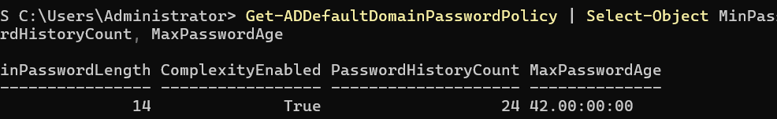

**Step 6 — Review the lockout baseline.** Confirmed the Account Lockout Policy had a threshold of 0 invalid attempts, meaning normal domain accounts would not lock out after repeated failures.

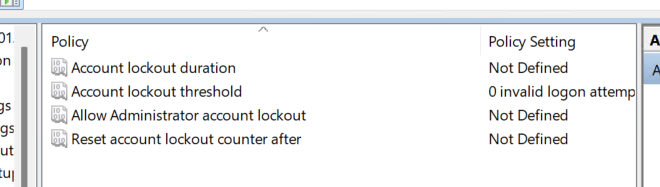

**Step 7 — Configure lockout controls.** Configured a 5-attempt threshold, 10-minute lockout duration, and 10-minute observation/reset window. Built-in Administrator lockout was disabled for this single-DC lab to reduce accidental administrative lockout risk.

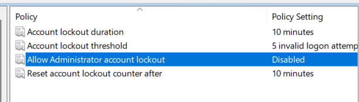

**Step 8 — Verify lockout policy** with PowerShell.

```powershell
Get-ADDefaultDomainPasswordPolicy | Select-Object LockoutThreshold,LockoutDuration,LockoutObservationWindow
```

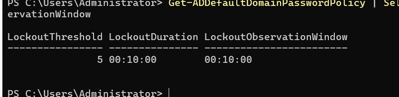

---

## 3. Lockout Enforcement and Recovery Test

**Step 9 — Establish Sarah's baseline.** Confirmed Sarah Johnson was enabled and not locked out before testing.

```powershell
Get-ADUser sjohnson -Properties Enabled,LockedOut | Select-Object Name,Enabled,LockedOut
```

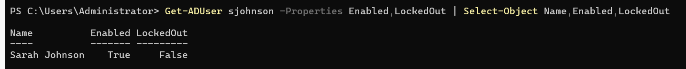

**Step 10 — Simulate failed authentication.** Generated repeated failed authentication attempts against Sarah's standard domain account using `runas`, avoiding the Administrator account.

```powershell
runas /user:ARTHURLAB\sjohnson cmd
```


**Step 11 — Confirm lockout.** Verified that the configured threshold was enforced and Sarah's `LockedOut` property became `True`.

```powershell
Get-ADUser sjohnson -Properties LockedOut | Select-Object Name,LockedOut
```

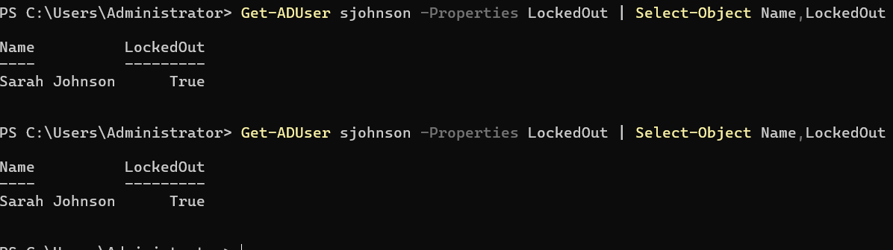

**Step 12 — Recover the account.** Unlocked Sarah with `Unlock-ADAccount` and immediately verified that `LockedOut` returned to `False`.

```powershell
Unlock-ADAccount -Identity sjohnson
Get-ADUser sjohnson -Properties LockedOut | Select-Object Name,LockedOut
```

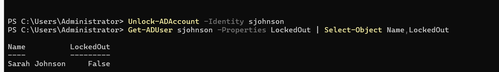

---

## 4. Custom OU-Scoped Group Policy

**Step 13 — Confirm departmental OU structure.** Confirmed Finance, Human Resources, IT, and Sales under ArthurLab Users.

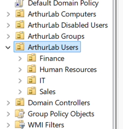

**Step 14 — Create and link the HR GPO.** Created "HR User Security Policy" and linked it directly to the Human Resources OU.

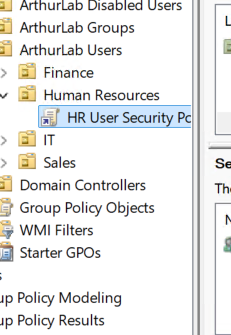

**Step 15 — Configure the HR restriction.** Enabled *Prohibit access to Control Panel and PC settings* under User Configuration → Administrative Templates → Control Panel.

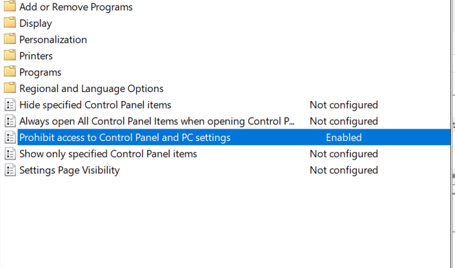

**Step 16 — Verify GPO settings.** Reviewed the GPO Settings report in Group Policy Management to confirm the configured user-side policy.

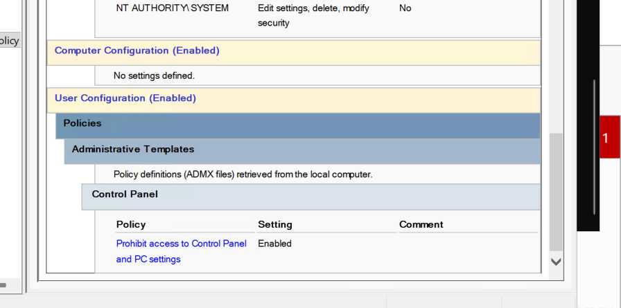

---

## 5. RSoP / Group Policy Modeling

**Step 17 — Confirm Sarah's HR placement.** Verified Sarah's `DistinguishedName` showed her in the Human Resources OU.

```powershell
Get-ADUser sjohnson | Select-Object Name,DistinguishedName
```

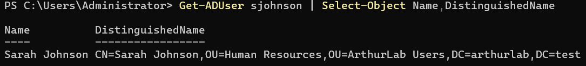

**Step 18 — Configure modeling context.** Modeled Sarah signing into a computer in the ArthurLab Computers OU without slow-link or loopback simulation.

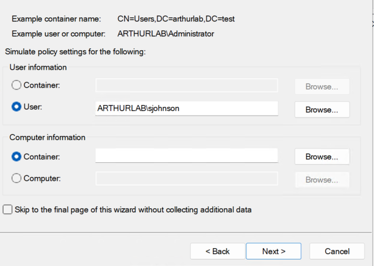

**Step 19 — Review simulation summary.** Validated the selected user, computer container, domain controller, and default simulation conditions before processing.

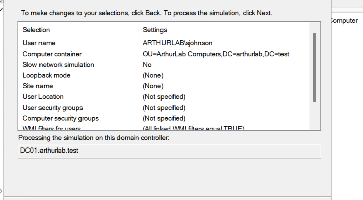

**Step 20 — Positive scope test.** The RSoP report showed the Control Panel restriction Enabled, HR User Security Policy as the Winning GPO, and the HR GPO under Applied GPOs.

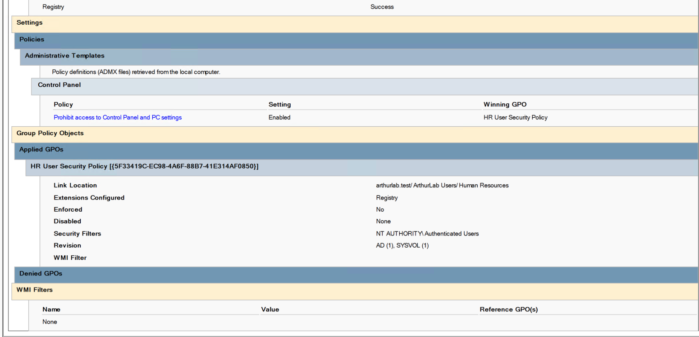

---

## 6. Negative Scope Test

**Step 21 — Create a Sales test identity.** Created David Wilson (`dwilson`) in the Sales OU as a Sales Representative to provide a clean non-HR test identity.

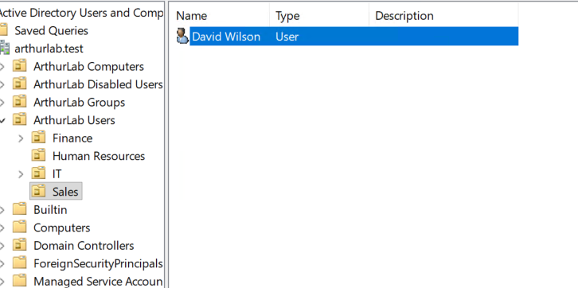

**Step 22 — Verify David's identity attributes.** Confirmed David was enabled, assigned to Sales, and located in the Sales OU.

```powershell
Get-ADUser dwilson -Properties Department,Title,Enabled | Select-Object Name,SamAccountName,Department,Title,Enabled,DistinguishedName
```

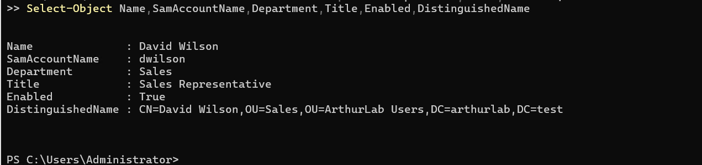

**Step 23 — Preserve actual group memberships.** During modeling, retained David's normal security groups without adding hypothetical memberships.

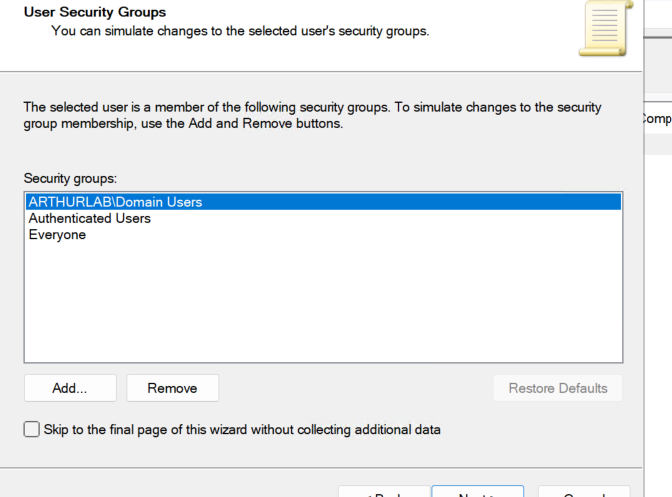

**Step 24 — Negative RSoP validation.** The modeling report showed no user settings and no applied HR GPO for David, confirming that the HR-linked policy did not affect Sales users.

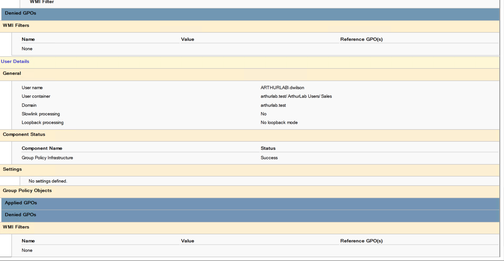

---

## 7. GPO Troubleshooting Exercise

**Step 25 — Capture the working security filter.** Captured the working Scope configuration: the GPO was linked to Human Resources and filtered to Authenticated Users.

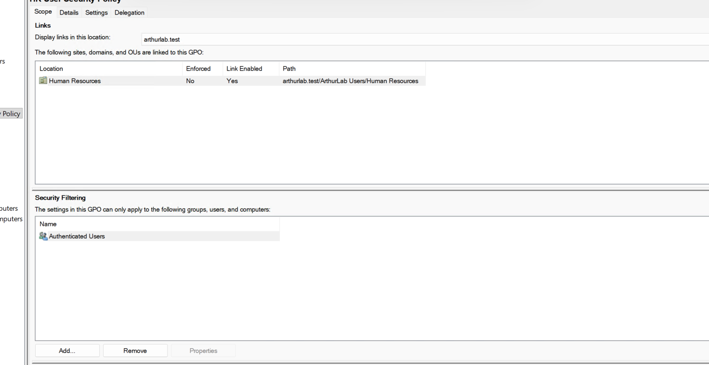

**Step 26 — Introduce a controlled misconfiguration.** Replaced Authenticated Users with David Wilson in Security Filtering. This intentionally created a condition where Sarah was in the linked OU but lacked permission to apply the GPO.

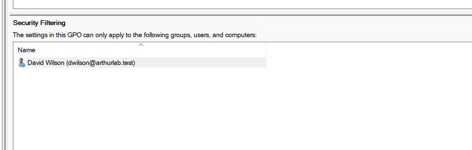

**Step 27 — Diagnose the failure.** Re-ran Group Policy Modeling for Sarah. The report placed HR User Security Policy under Denied GPOs and explicitly reported "Access Denied (Security Filtering)."

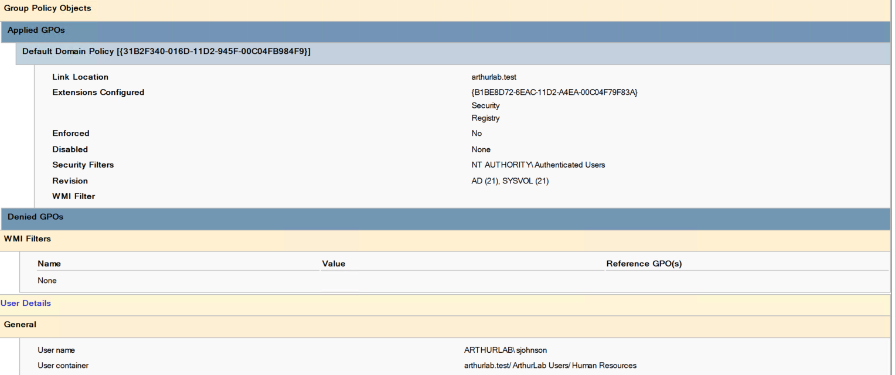

**Step 28 — Restore intended filtering.** Removed David from Security Filtering and restored Authenticated Users.

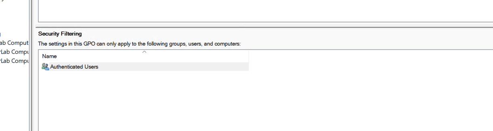

**Step 29 — Revalidate remediation.** A final RSoP simulation confirmed the HR restriction was Enabled, HR User Security Policy was again the Winning GPO, and no GPO was denied.

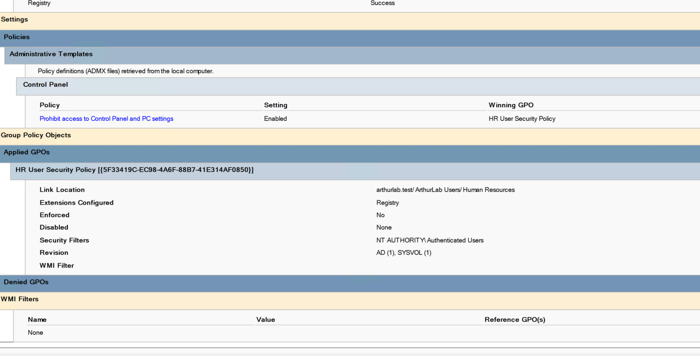

---

## 8. Security Policy Auditing and Reporting

**Step 30 — Inventory GPOs.** Used PowerShell to inventory all domain GPOs and capture status, creation time, and modification time.

```powershell
Get-GPO -All | Select-Object DisplayName,GpoStatus,CreationTime,ModificationTime
```

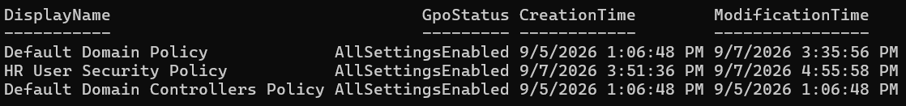

**Step 31 — Generate a detailed GPO report.** Generated an HTML report for HR User Security Policy and verified the artifact existed at `C:\HR-GPO-Report.html`.

```powershell
Get-GPOReport -Name "HR User Security Policy" -ReportType Html -Path "C:\HR-GPO-Report.html"
Get-Item "C:\HR-GPO-Report.html" | Select-Object Name,Length,LastWriteTime
```

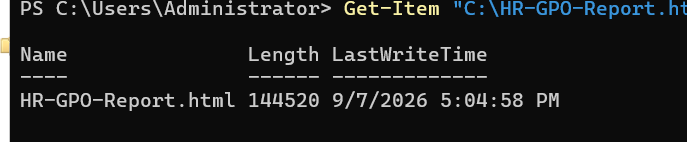

**Step 32 — Final domain security audit.** Captured the final password and lockout configuration as closing evidence for the project.

```powershell
Get-ADDefaultDomainPasswordPolicy | Select-Object MinPasswordLength,ComplexityEnabled,PasswordHistoryCount,MaxPasswordAge,LockoutThreshold,LockoutDuration,LockoutObservationWindow
```

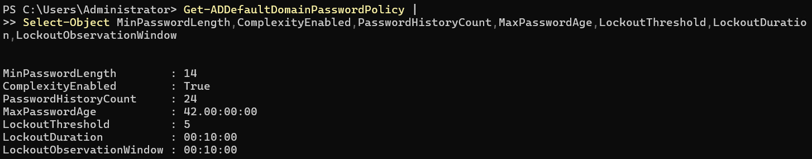

---

## Key Skills Demonstrated

- Active Directory Group Policy administration and OU-based scoping
- Domain password and account lockout security controls
- Group Policy Modeling / Resultant Set of Policy (RSoP)
- Positive and negative policy-scope validation
- Security Filtering analysis and GPO troubleshooting
- PowerShell-based identity recovery, GPO inventory, and security-policy auditing
- Administrative reporting with `Get-GPOReport`
